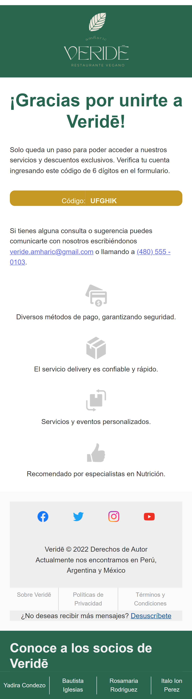

# Correos-Veride
Maquetación para correos para las siguientes vistas: '🔐 recuperar contraseña' y '✅ verificar contraseña'; complementando al proyecto de Ecommerce 'Veride'

### 1. ✅ Verificar Cuenta: 

Cuando el Usuario solicite crearse una cuenta, automaticamente se enviará un código de verificación al correo con dicha maquetación.

### 2. 🔐 Recuperación de Cuenta: 

Cuando el Usuario solicite recuperar o cambiar su contraseña, automaticamente se enviará un código de verificación al correo con dicha maquetación.

## Mockup de ambas vistas

## 💻 Vista Escritorio

| ✅ Verificar Cuenta | 🔐 Recuperación de Cuenta |
|--|--|
|

 |

|

## 📱 Vista Celular

| ✅ Verificar Cuenta | 🔐 Recuperación de Cuenta |
|--|--|
|

|

|

